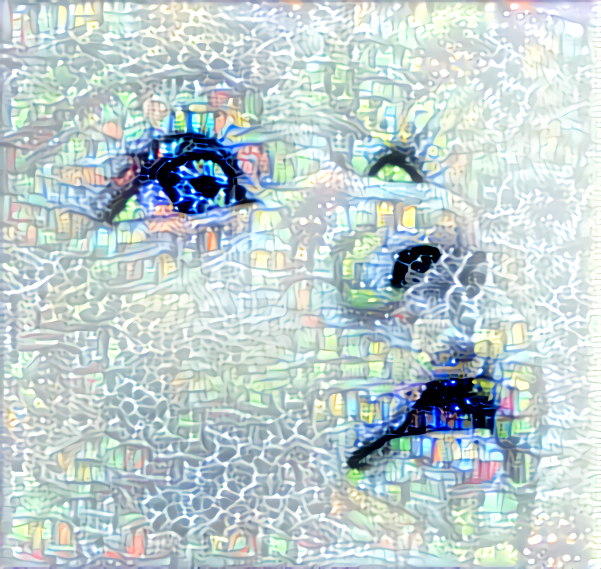

# Deep-Neural-Style-Transfer-VGG19
Deep Neural Style Transfer with Keras

# Library Installations:
 
- Anaconda
- Tensorflow / Keras
- scipy

- https://www.anaconda.com/products/individual
- https://docs.anaconda.com/anaconda/user-guide/tasks/tensorflow/
- https://anaconda.org/conda-forge/keras

# Run Style Transfer
python style_transfer.py img/original.jpg img/effect.jpg results/my_result

#Credit

Ref Img: (original.jpg)
"Precious" is a drawing by Natasha Denger which was uploaded on July 26th, 2012.
https://fineartamerica.com/fea…/precious-natasha-denger.html

# Keras Documentation
#- [A Neural Algorithm of Artistic Style](http://arxiv.org/abs/1508.06576)
